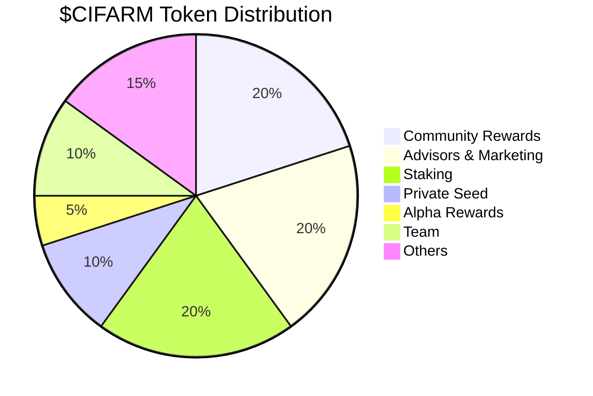

# $CIFARM Token

$CIFARM is a multi-chain, community-owned token used across all premium aspects of CiFarm, the innovative Web3 farming and thieving simulator.

Players use $CIFARM to unlock the full experience of CiFarm:

🥭 Premium NFT Crops (Optional):
- Dragon Fruit
- Jackfruit
- Pomegranate
- Rambutan

> 💡 Note: Regular gameplay uses in-game gold. NFT crops are premium features that require $CIFARM tokens.

🧑‍🌾 Trade on the Marketplace

## 🔐 About the Token

$CIFARM is secured by multiple blockchains and optimized for gameplay, offering fast, low-cost, and seamless experiences for players. While the game is fully playable with in-game gold, $CIFARM tokens unlock premium features and exclusive content.

**Networks:**
- SUI
- Solana
- Somnia (Coming Soon)

**Total Supply:** 1,000,000,000 $CIFARM

**Multi-chain Ready:** Supplies may vary across supported chains

## 🛒 How to Buy $CIFARM?

$CIFARM trading will be available soon on decentralized exchanges:

- SUI Network: Coming Soon
- Solana Network: Coming Soon
- Somnia Network: Coming Soon

> ⏳ Token trading will be enabled after the initial distribution phase. Stay tuned for updates!

## 🏦 How to Deposit $CIFARM?

Ready to use your $CIFARM in game?

1. Open the Assets in the left sidebar 💎
2. Follow the instructions and send $CIFARM to the address provided
3. Only deposit $CIFARM into the address provided on the correct network
4. Always double check the address and network ✅

> ⚠️ This address may change each time for security

## ♻️ Recyclable Economy

CiFarm operates on a unique vault-based reward system that creates a sustainable ecosystem for all players.

### NFT Fruit & Vault System

🌱 **NFT Fruit Purchases**
- 100% of $CIFARM spent on NFT fruits goes to the vault
- Vault funds are used for player rewards

### Ship to Vault Rewards

🚢 **How it Works:**
1. Plant your NFT fruits
2. Ship them to the vault
3. Earn $CIFARM tokens as rewards

📊 **Reward Structure:**
- Rewards decrease over time
- Early shipments receive higher rewards
- Each season resets the reward rates
- Creates incentive for active participation

> 💡 Tip: Ship your fruits early in the season for maximum rewards!

## 📅 Token Distribution

Total Supply: 1,000,000,000 $CIFARM

### Community-First Approach

**Community Rewards (20%)**
- Daily rewards for active players
- Ship into vault rewards

**Advisors & Marketing (20%)**
- Community growth initiatives
- Strategic partnerships
- Global marketing campaigns
- Community events and meetups

**Staking Program (20%)**
- Linear vesting schedule
- Rewards for long-term holders
- Ecosystem stability

**Private Seed (10%)**
- Early supporters
- Strategic partners
- Foundation for growth

**Alpha Rewards (5%)**
- Early community members
- Testnet participants

**Team (10%)**
- Core development team
- Operations team
- Community managers

**Others (15%)**
- Reserve fund
- Future initiatives
- Emergency fund
- Ecosystem development

> 💎 The distribution is designed to prioritize community growth and long-term sustainability.

## 💵 Team Revenue

CiFarm's team revenue comes from in-game activities, ensuring alignment with player success:

- Marketplace fees
- Teams Token

This model ensures that the team's success is directly tied to the game's success and player satisfaction.

## 🎁 How to Earn $CIFARM?

$CIFARM rewards are designed for active players who contribute to the ecosystem:

📦 **Complete Deliveries**
- Ship fruits to the vault
- Earn rewards based on timing
- Participate in seasonal events

🤝 **Community Participation**
- Join community events
- Participate in competitions
- Help other players

🎉 **Special Events**
- Seasonal challenges
- Community competitions

> 🌟 The more you participate, the more you earn!

## 🚀 What's Coming for $CIFARM?

> ⏳ More exciting features coming soon!

## 🔄 Migration Plan

Coming soon: Migration from testnet tokens to mainnet $CIFARM

## 🎁 Launch Rewards

To celebrate the launch of $CIFARM, bonus rewards will be available for:

1. Early liquidity providers
2. Active players
3. Community contributors
